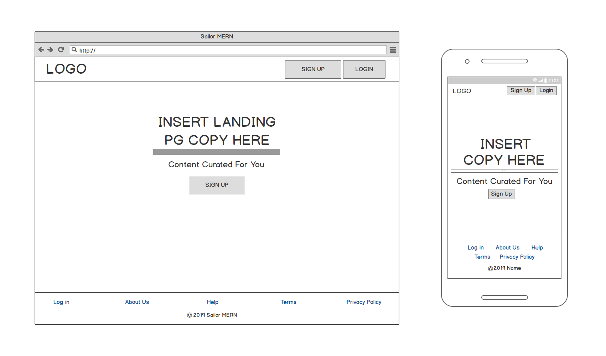
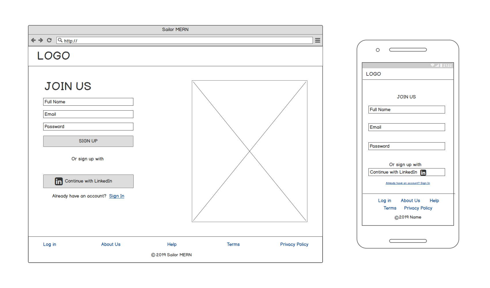
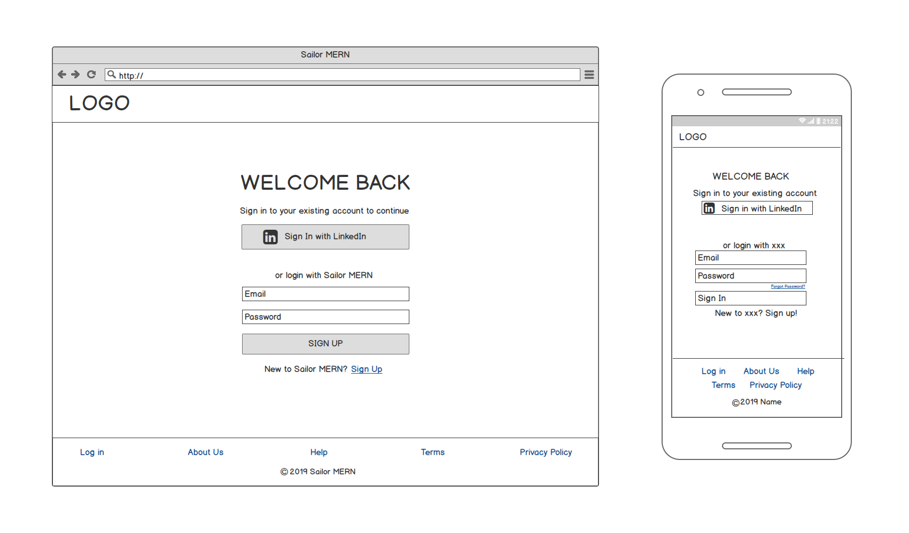
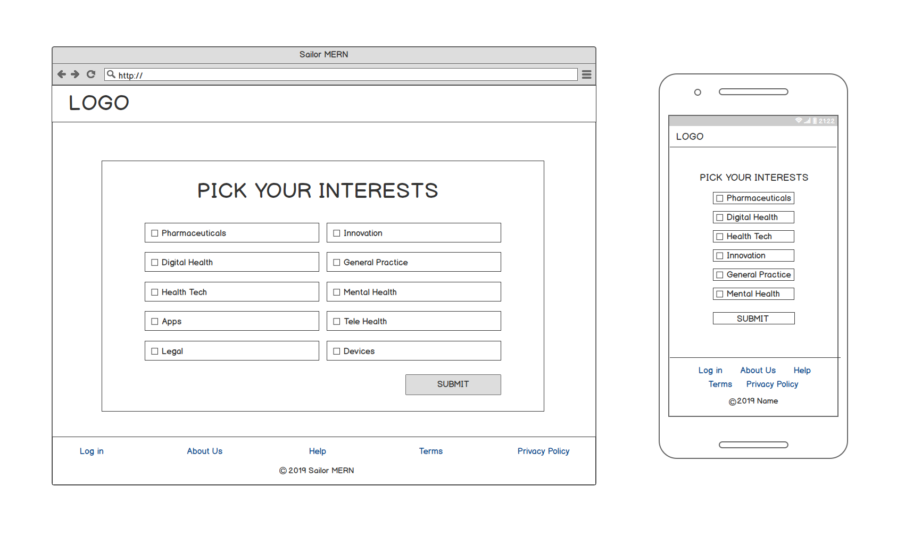
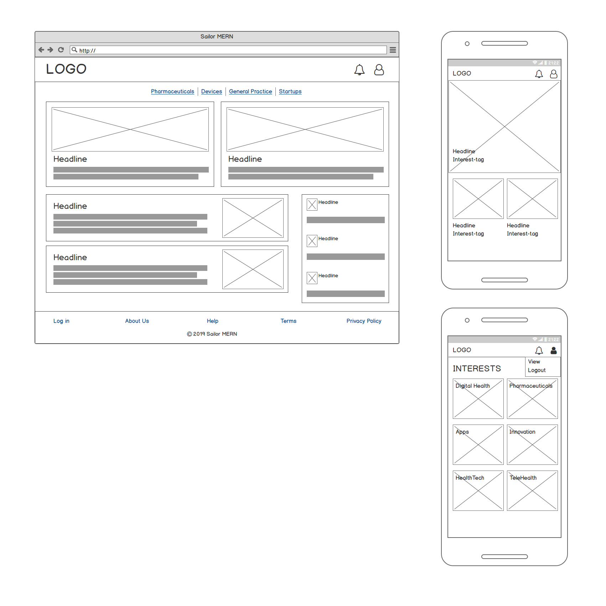
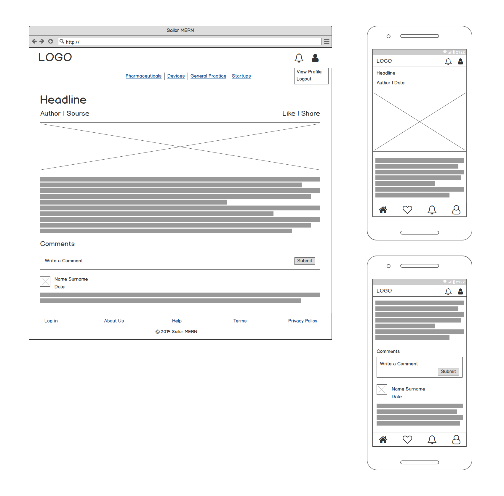
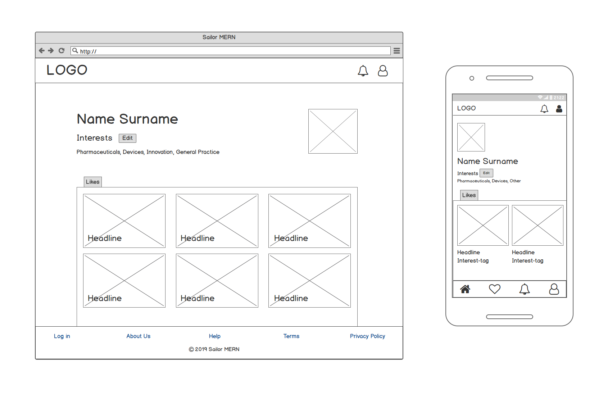
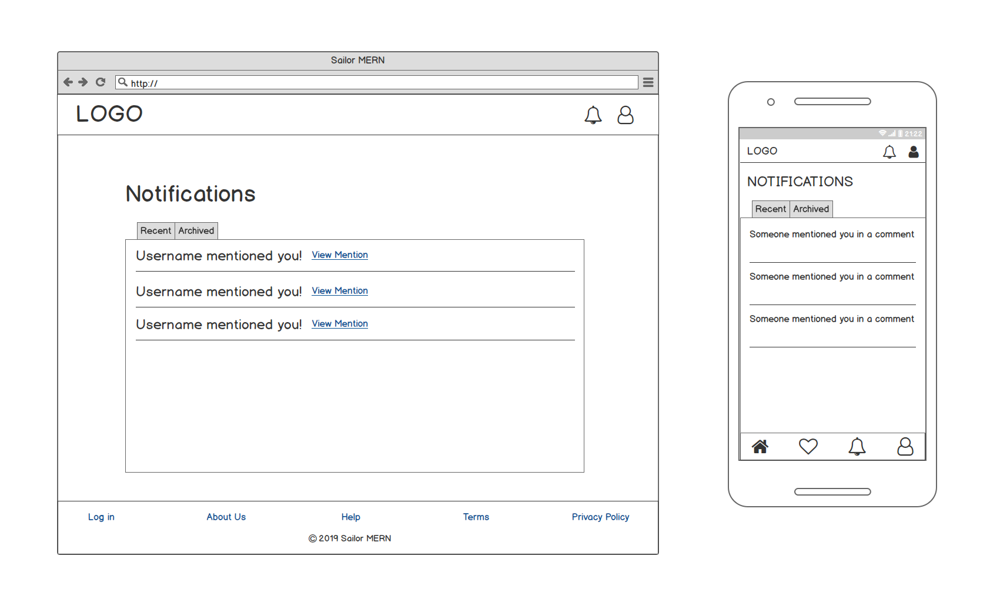
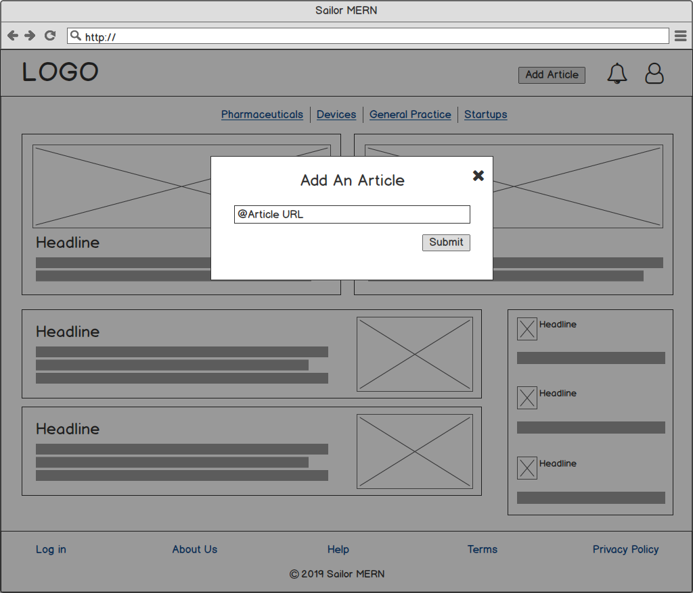

# Sailor MERN
### By Alex Diwa, Alyssa FitzGerald, Leah Hou and Natasha Khatri

### App URL

### GitHub Repos
- Back-End (Express): https://github.com/tashk85/sailor_mern_backend
- Front-End (React): https://github.com/lyssfitz/sailor_mern_frontend

## Description Of Project
Sailor MERN is a web application that is intended to enable early-stage start-ups to start building an audience by curating and crowd-sourcing content relevant to their industry. 

## Problem Definition / Purpose

The app aims to help a start-up – in this case, DigitalHealthX, a company in the Digital Health industry that wants to build an audience in the early stages of their company. 

Traditionally, a company would start their own blog to attract people who are interested in their industry. But with the increasing number of information sources available, it's difficult to get noticed in the crowd. This app gives DigitalHealthX the platform to build an audience of people, which has content relevant to their industry. 

This is achieved by sourcing articles and content through RSS Feeds, which can be sorted according to "interest tags" or keywords. The user is able to choose which interest tags they want to follow, and this allows them to read all relevant content within the one application instead of going to several different sites. 

DigitalHealthX believes that this would be more engaging than a blog or traditional content with people facing increasing levels of digital "noise" through notifications and emails.

## Functionality / Features

Users will have the ability to:
    
* View a landing page that directs them to either sign up or login to view content.
* Sign up for a new account using their email or through LinkedIn as an OAuth provider (and have this information stored in the database)
* Login to their existing account (retrieving said information from the database)
* Select and save their interests tags from a form e.g. Digital Health.
* View a curated feed of articles that relate to the interest tags chosen.
* Select a tag and filter the feed according to interest tag chosen.
* View an individual article within the app.
* Like, Share or Comment on an article.
* Mention another user in their comment on an article.
* View their profile page, which shows their:
    * Full Name
    * Linkedin profile (if they used Linkedin OAuth to sign in)
    * Interest tags 
    * Articles they have liked
* Edit their interest tags according to what content they want to see.
* Logout of their account.

## Screenshots

### Landing Page

### Login Page

### Signup Page

### Interests Form

### Feed Page

### Individual Article

### Profile Page

### Notifications Page

### Admin View - Add An Article

### Tech Stack

For the tech stack on this project we are using a combination of front end and back end technologies.
- MongoDB 
- Express.js
- React/Redux
- Node.js
- HTML
- CSS (Bootstrap, SASS, Flexbox)
- Heroku for deployment of Express app
- AWS S3 for deployment of React app
- GitKraken / Github for version control
- Monday & Trello boards for project management
- Google Sheets / Google docs for docs, planning and organization
- Cypress for automated testing

## Instructions on how to setup, configure, deploy and use your App

To use the live app, go to https:// and set up an account.

For local use of the app, perform the following operations:

**Express Server:**
- From a bash CLI, clone the back-end git repository locally: git clone https://github.com/tashk85/sailor_mern_backend.git
- Move into the directory: cd sailor_mern_backend
- Install npm packages: npm install or yarn install
- Ensure mongoDB is running
- Create a .env file in the root directory, with the following variables: DB_HOST set to mongodb://localhost/backend, PORT set to 3000, SESSION_SECRET to any password, JWT_SECRET to any password, LINKEDIN_KEY and LINKEDIN_SECRET to your LinkedIn Developer credentials, REACT_URL to your react server URL http://localhost:3001.
- Start the server: npm run server and allow the RSS feed to load, then press CTRL + C to stop the server.
- Seed the database with admin users and categories: npm run seed
- Start the server again: npm run server

**React App:**
- From a bash CLI, clone the front-end git repository locally: git clone https://github.com/lyssfitz/sailor_mern_frontend.git
- Move into the directory: cd sailor_mern_backend
- Install npm packages: npm install or yarn install
- Create a .env file in the root directory with variable REACT_APP_API_URL set to your node server URL http://localhost:3000.
- Start the server: npm start or yarn start, when prompted to change port say yes.
- This will automatically open up the application in your browser, if not, go to http://localhost:3000
- Enjoy!

## Design Process
Our design process began with gathering requirements from the client, which we formed into user stories. Once we had the user stories, we created a user workflow diagram that helped us to define the overall scope of the project. With this information, we created our wireframe designs for desktop and mobile versions. With user stories, user workflow and wireframes finalised, we created a database schema diagram which defined how our models were designed and how they interacted with each other. 

## User Stories

1. As a user, I want to sign up and create my profile on the website using my LinkedIn account.

2. As a user, I want to sign up and create my profile on the website using my email.

3. As a user, I want to sign up and select my interest tags so that I can choose the content I see.

4. As a user, I want to view my profile so that I can see my selected interests and articles that I have liked.

5. As a user, when I sign in I want to see a curated feed of articles that match my interest tags.

6. As a user, when I sign in I want to be able to filter my feed by interest tags so that I can see stories that match a particular tag.

7. As a user, I want to like, comment and share articles with others.

8. As a user, I want to see the number of likes on an article.

9. As a user, I want to see a list of articles that I have liked.

10. As a user, I want to be able to mention other users in the comments of an article.

11. As a user, I want to receive a notification if another user mentions me in the comments of an article.

12. As a user, I want to read articles in the app according to my screen size.

13. As a user, I want to receive push notifications that show me the top content related to my interest tags. (stretch goal)

14. As a user, I want to be able to change the frequency of my notifications. (stretch goal)

15. As an administrator, I want to be able to do all functions that a general user can do.

16. As an administrator, I want to be able to view and approve user submissions. (stretch goal)

17. As an administrator, I want to be able to delete content including articles and comments that are inappropriate. (stretch goal)

## User Workflow Diagram:

## Wireframes:
### Landing Page

### Signup Page

### Login Page

### Interests Form

### Feed Page

### Individual Article

### Profile Page

### Notifications Page

### Admin View - Add An Article

## Database Entity Relationship Diagram:

## Data Flow Diagram:

## Object Orientated Design Documentation:

## Project Management & Planning
### Project Plan & Timeline
Our project plan was to find a client before the 8th of July so that we would have more time to complete the client's project requirements as well as preparing our documentation and presentation materials. 

After reviewing a few possible client projects, we decided to go with DigitalHealthX (DHX) as our client. The first day was spent having a meeting with DHX to gather a better understanding of their requirements and clarifying any points we weren't sure about. From this we developed a Scope of Work as our contract to clearly outline our MVP and the terms of our services, which we had signed and confirmed by the client on 9th July. 

Once we had the MVP outlined, we were able to start working on the user workflow, wireframes and fleshing out user stories. From this we then developed our schema design to understand how we would be saving and retrieving data.

During the planning stage, we also created kanban boards to show tasks that were required overall and also broke these down into sprints. We used agile methodologies, Monday and Trello to keep track of our progress.

For team communication, we had daily team meetings or standups when in class, and also regularly updated team members on things over Slack. We also pair programmed for various features such as RSS Feed setup, Passport strategy setups, etc, which was a great experience as we problem solved by learning and bouncing ideas off each other.

[Project Timeline / Schedule](https://docs.google.com/spreadsheets/d/1fGG65gWizXOoDz-YIhjsBX32_et9eCEjYWJCg3eeyl4/edit?usp=sharing)

### Client Communications
We kept in contact with DigitalHealthX throughout the project, asking questions and providing updates and feedback. Since our communication with DHX was done remotely, we communicated with them primarily using Slack and email along with phone calls including an initial Zoom conference meeting.

[Client Meeting Minutes](https://)
[Client Slack Group Conversations](https://)

### Screenshots of Project Management Board(s)

For this project, we used Monday.com's boards for project management. We split tasks into sprints, which defined tasks in more detail according to the feature we were working on. This helped us see everything at a glance and helped us to track our progress. 

## Short Answer Questions
### 1. What are the most important aspects of quality software?

1. **Functionality** of the software is an important aspect as it must perform the required functions in order to serve its purpose. For example, an ATM machine provides numerous functions from checking your bank account balance to withdrawing and depositing cash. If an ATM machine did not allow withdrawals, an essential function of this software would be missing, which would make it poor quality.

2. **Reliability** of the software is important in terms of its capability to perform services under specified conditions over specified periods of time. For example, the recent Telstra systems outage which caused network issues for eftpos machines was due to an increased surge in network traffic. However, once this was fixed, the software was able to recover and continue functioning.

3. **Usability** of the software is important in terms of the ease with which a user can use the software, learn to operate the software and interact with it via the user interface. For example, links on a website should be clearly identifiable through use of hover effects or text to show that an action can be taken.

4. **Efficiency** of the software is important to show how the software performs in terms of its use of time and resources such as disk space and memory. For example, if an ATM machine took 30 minutes to dispense cash it would greatly affect its efficiency and therefore also reduce usability.

5. **Maintainability** of the software is important in terms of the ability to fix, update and modify software to improve its performance or to correct faults. This can also be impacted by the legibility and complexity of code used. For example, a smart phone requires regular software updates to fix bugs and add new functionality, this improves the user experience and therefore reflects high quality software.

6. Software **Security** is an essential component of quality software due to the increasing potential for having vulnerabilities where sensitive information can be exposed, or the occurrence of cross-site scripting and SQL injection. By taking precautions for security during the development process of software such as controlling the type of input accepted by forms, this would protect the user and their information reflecting a high quality software.

#### 2. What libraries are being used in the app and why?

- **Express** is the Node web server framework that allows us to create all the routes that our React app will use to request and post data
- **Node** is used to run Javascript and install packages.
- **CORS** is being used to accept cross origin requests from our React application.
- **Mongoose** is being used to handle creating our model schemas and for querying the MongoDB database.
- **Dotenv** enables us to load environment variables from our .env file which stores our applications private information such as passwords and API keys.
- **Mongoose-bcrypt** enables us to encrypt and verify user passwords in the database.
- **Celebrate** is being used for validation to ensure all user inputs are correct before handing it down to functions.
- **jsonwebtoken** is being used to generate json web tokens which authorise users to access the application.
- **Passport** is being used for authentication of requests and allows us to direct users to correct routes according to their authorisation status.
- **Passport-jwt** is being used to authenticate requests using a json web token.
- **Passport-local** is being used to allow users to login using email and password which is authenticated and stored locally on the database.
- **Passport-linkedin-oauth2** is being used to allow users to login using LinkedIn OAuth strategy and allows us to access basic profile information from their accounts.
- **Axios** is being used to handle requests on our routes between Node/Express server and React application.
- **Cron** is being used to allow us to execute a function on a timed schedule.
- **Article-parser** is being used to extract the main article, image and meta-data from a given URL.
- **RSS-parser** is being used to turn RSS XML feeds into Javascript objects.
- **React** is being used to create the front-end interface.
- **React-dom** is being used to render components.
- **React-router-dom** is being used to route to specific components depending on the URI.
- **React-redux** is being used to handle state in a centralised store.
- **React-scripts** enables us to run scripts from the command line.
- **Redux-thunk** allows us to write asynchronous action creators that return a function instead of an action.
- **React-html-parser** is being used to convert HTML strings from the article-parser into React components.
- **Query-string** is being used to parse and stringify URL query strings.
- **Ant Design** is a React component library that allows us to style our components quickly. It makes the development process easier and enhances the experience (UI/UX) for the user.
- **Styled-components** allows us to style individual components and elements, as well as customise imported Ant Design components.
- **Jest** is being used as our testing framework.
- **Cypress** is being used for end to end and integration testing.

#### 3. A team is about to engage in a project, developing a website for a small business. What knowledge and skills would they need in order to develop the project?

The team would need to have a good understanding of web technologies including how the internet works and HTTP protocols. This would also involve having technical skills and knowledge of HTML and CSS, testing and deploying. To be able to create a more complex and dynamic website they would need to familiar with frameworks such as Ruby on Rails or the Javascript MERN stack, which would also involve knowledge of database design. Project management and planning skills would allow the team to plan the project by dividing tasks among team members, keep on track with tasks and keep everything organised using tools such as Trello or Monday. Project planning skills also include being able to take requirements from the client and forming user stories, user work flows and wireframes. Communication skills are necessary for the team to work effectively, as they need to collaborate on tasks, share information and update team members on task progress. They would also need to communicate with the client in regards to scope of work, design approvals and to share progress of the website. It would also be advantageous for the team to have knowledge in version control using git to allow team collaboration when coding the website.

#### 4. Within your own project what knowledge or skills were required to complete your project, and overcome challenges?

We required a good understanding of the MERN stack as this was a requirement of our project. This involved knowledge of MongoDB and Mongoose to retrieve data, Express.js to create the server and routes for the front-end to request data, and React to retrieve and render the data to the user. To use this framework, we also required knowledge of Javascript, JSX, HTML and CSS, which allowed us to build the application and style the user interface. 
Knowledge of git for version control was required as we had to continually keep track of changes in our source code, as well as work on separate branches for individual tasks to avoid merge conflicts that can arise with multiple people working on the same repository. We also required design skills for styling of the application, which was further enhanced by using libraries such as Ant Design and styled-components to enhance the user interface without the need for extensive CSS styling. This also helped us to make the application responsive to screen-size which was one of our MVP requirements.
Our knowledge of passport and celebrate was required to implement the authentication and authorisation of users accessing the application. We encountered some challenges when implementing the LinkedIn OAuth strategy with outdated documentation as well as some difficulty reaching the callback api and sending the authorisation token to the front-end. We eventually sourced a package that had updated the strategy, edited the controller method to send a redirect url with a token in the params for the front-end to extract and use for authorisation of the user.
We also required a knowledge of agile methodologies to plan and manage our development process. This included planning through creating user stories, creating a work scope for the client to agree on MVP, tracking our progress through use of Monday and Trello boards, collaborating with standups and team meetings, and communicating progress with the client.
We also required knowledge and skills to deploy our site on Heroku, MongoDB Atlas and AWS S3, where we had to overcome challenges. 

#### 5. Evaluate how effective your knowledge and skills were this project, using examples, and suggest changes or improvements for future projects of a similar nature?

- Alex -

- Alyssa -

- Leah -

- Natasha -